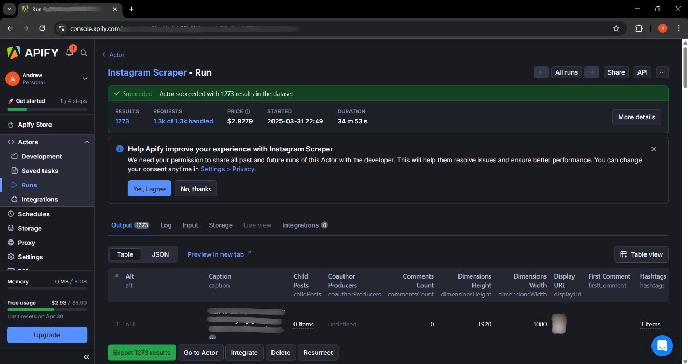

```{r setup, include=FALSE}
knitr::opts_chunk$set(
  message = FALSE,
  warning = FALSE,
  fig.align = "center",
  out.width = "600px", 
  fig.retina = 1,
  comment = ">"
)
```

```{r include=FALSE}
colorize <- function(x, color) {
  if (knitr::is_latex_output()) {
    sprintf("\\textcolor{%s}{%s}", color, x)
  } else if (knitr::is_html_output()) {
    sprintf("<span style='color: %s;'>%s</span>", color,
      x)
  } else x
}
```

<hr>

***Disclaimer**: The data presented is derived from public Instagram content. All account names and usernames displayed have been replaced with pseudonyms to protect the privacy of the original account holders. This anonymization prevents identity tracing, misuse of data, or harm to third parties. There is no association between these aliases and real Instagram accounts.*

<hr>

# `r colorize("**Project Overview**", "#8093f1")`

AO Snack (`r colorize("@aosnack.brand", "#8093f1")`) (*pseudonym*), a healthy snack brand, uses Instagram to build brand awareness and engage with its audience. I'm taking a role as a data analyst to extract insights and provide recommendations to the social media and marketing teams to drive higher engagement on the Instagram account. 

This page outlines the technical details, covering the processes of data extraction, data cleaning, and preparation for analysis, followed by an in-depth insights exploration. Insights and recommendations report can be accessed on my GitHub [`r colorize("here", "#8093f1")`](https://github.com/andrewanggoh/instagram-account-engagement-analysis).

# `r colorize("**Objective**", "#8093f1")`

The main objective of this analysis is:

- **Content Engagement Analysis**: To identify and understand post characteristics, including topics, post types, and influencer involvement, that drive high audience engagement.

In line with this objective, the analysis seeks to answer key business questions, including:

- [`r colorize("Which posts achieved the highest engagement?", "black")`](#Q1)
- [`r colorize("How have engagement trends and growth rates evolved over time?", "black")`](#Q2)
- [`r colorize("Which post type drives higher engagement: video or photo?", "black")`](#Q3)
- [`r colorize("How do video durations affect engagement and completion rates?", "black")`](#Q4)
- [`r colorize("Does posting time significantly impact engagement?", "black")`](#Q5)
- [`r colorize("How do collaborations influence engagement performance?", "black")`](#Q6)

<br>

# `r colorize("**Data Extraction**", "#8093f1")`

The dataset of AO Snack (`r colorize("@aosnack.brand", "#8093f1")`) Instagram account was collected using the [`r colorize("Apify Instagram Scraper", "#8093f1")`](https://apify.com/apify/instagram-scraper). The dataset consists of post metrics retrieved on March 31, 2025 at 10:49 PM (GMT+7) . It includes all posts from the account's inception up to the time of data scraping. The collected metrics include likes, comments, tagged users, and various other engagement indicators. After the scraping process, the dataset was filtered to include only the required metrics and then exported to a CSV file.

<br>

```{r echo = FALSE, out.width="90%", fig.align = "center", fig.cap = "Figure 1. Apify Instagram Scraper Web View"}

```

<br>

# `r colorize("**Data Cleaning and Preparation**", "#8093f1")`

## `r colorize("**Libraries**", "#79b8f4")`

```{r, console=FALSE}
library(dplyr)
library(tidyr)
library(lubridate)
library(writexl)
library(ggplot2)
library(scales)
library(moments)
library(effsize)
```

<br>

## `r colorize("**Import Dataset**", "#79b8f4")`

```{r}
df <- read.csv("data_input/instagram_post_dataset.csv")
head(df)
```

<br>

In the imported dataset, there are empty data that can be considered as *missing values* (NA). Therefore, the data is re-imported with additional arguments to make empty data into NA.

<br>

```{r}
df <- read.csv("data_input/instagram_post_dataset.csv", na.strings=c("","NA"))
head(df)
```

<br>

Here is a peek of the dataset :

<br>

```{r}
glimpse(df)
```

<br>

## `r colorize("**Data Description**", "#79b8f4")`

Some of the attributes scraped using Apify contain sub-attributes. For example, the coauthorProducers attribute includes sub-attributes such as id, username, and other related attributes. Each attributes and sub-attributes is represented by a single column in the dataset. During the reshaping stage, all attributes and sub-attributes with indexing will be merged into a single set of columns (one for each attribute) without numerical indexing. Here is an explanation of the columns in the dataset :

<hr>

- **`coauthorProducers`** : represents the accounts that are *co-authors* of a post. Each account has several attributes, including:
  - **`is_verified`** : verification status of the account (true/false).  
  - **`username`** : username of the account.  
- **`commentsCount`** : the number of comments on the post.  
- **`likesCount`** : the number of likes the post received.  
- **`mentions`** : accounts that are mentioned in the post.  
- **`ownerFullName`** : full name of the account owner who posted the content.
- **`ownerUsername`** : username of the account owner.
- **`productType`** : the type of content uploaded (clips, igtv, and photo).
- **`taggedUsers`** : accounts that are tagged in the post. Each account has several attributes, including:  
  - **`full_name`** : full name of the tagged user.
  - **`is_verified`** : verification status of the tagged account (true/false). 
  - **`username`** : username of the tagged account.
- **`timestamp`** : the time when the post was created.  
- **`type`** : the type of post (video, image, and sidecar).  
- **`videoDuration`** : the duration of the video (if the post is a video).
- **`videoPlayCount`** : the number of times the video has been played.
- **`videoViewCount`** : the number of times the entire video has been watched.

<hr>

## `r colorize("**Add Column ID of Posts**", "#79b8f4")`

Before going further, column **`id`** is added for identification (ID) of each post that represented by each row. Column **`id`** will help in identifying each post for further data analysis. First, data type of **`timestamp`** will be changed to `datetime` then the dataset will be sorted by **`timestamp`**. This process will assign sequential IDs to the posts, where the first post will be given ID 1, the second post will have ID 2, and so on.

<br>

```{r}
df_clean <- df %>% 
  # Change column `timestamp` data type to `datetime`
  mutate(timestamp = ymd_hms(timestamp, tz = "Asia/Jakarta")) %>%
  # Sort dataset by column `timestamp`
  arrange(timestamp)
```

```{r}
# Add column `id`
df_clean <- df_clean %>% mutate(id = row_number())
```

```{r}
glimpse(df_clean)
```

<br>

## `r colorize("**Missing Values**", "#79b8f4")`

```{r}
# Check for missing values
colSums(is.na(df_clean))
```

<br>

Based on the result, there are missing values in column **`mentions..`**, **`taggedUsers..`**, **`productType`**, **`coauthorProducers..`**, **`videoViewCount`**, **`videoPlayCount`**, and **`videoDuration`**. To handle these missing values, I will reshape the dataframe, apply an imputation method, and perform feature engineering.

<br>

### `r colorize("**Reshaping Dataframe**", "#79b8f4")`

Before reshaping the data, I will impute the missing values on column **`coauthorProducers.`**, **`mentions.`**, dan **`taggedUsers.`** with index **`.0`**. It will give an information for posts that doesn't have co-author producer, mention, or tagged user.

<br>

```{r}
df_clean <- df_clean %>% 
  mutate_at(vars(starts_with("coauthorProducers.0")), ~replace(., is.na(.), "No co-author")) %>% 
  mutate_at(vars(starts_with("mentions.0")), ~replace(., is.na(.), "No mention")) %>% 
  mutate_at(vars(starts_with("taggedUsers.0")), ~replace(., is.na(.), "No tag"))
```

<br>

For column **`mentions..`** that doesn't have sub-attribute, reshaping process will consists of pivot longer (wide to long) and column modification. Pivot longer will produce two new columns i.e. `name` and `value`. Column `name` will be remove because it is unneeded. Column `value` will be kept and it will be rename to **`mention_username`**.

At the end of the process, there will be rows with missing value in column **`mention_username`**. These rows are unnecessary because mention attribute information for each post already represented by mentioned username or "No mention". Therefore, these rows with missing value will be remove.

<br>

```{r}
df_clean <- df_clean %>% 
  # Reshape attribute `mentions` from wide (columns) to long (rows)
  pivot_longer(cols = starts_with("mention"),
               values_to = "mention_username") %>%
  # Removed column 'name' because it is unnecessary
  select(-name) %>% 
  # Remove rows that contains missing value in column `mention_username`
  drop_na(mention_username)
```

<br>

For column **`coauthorProducers..`** and **`taggedUsers..`** that have sub-attributes, there will be some differences reshaping process. For this case, I made a custom function named **`longer(..)`**. This function will reshape the columns of attributes and its sub-attributes with many index in wider format into columns of attributes and its sub-attributes in longer format without index. The full explanation about this function (**`longer(..)`**) is in [`r colorize("**Custom Function Validation**", "#8093f1")`](#FunctionValidation) at the end of this project.

<br>

```{r}
# Custom Function -> `longer(..)`
longer <- function(x, y){
  # Reshape columns from wide to long
  pivot_longer(data = x,
               # Select columns with name that starts with argument `y`
               cols = starts_with(y),
               # Produce three columns of attribute, index, and sub-attribute
               names_to = c("attribute", "index", "sub-attribute"),
               # Column name separator `.` that separate attribute, index, and sub-attribute
               names_sep = "\\.") %>% 
    # Remove column attribute because it's not needed
    select(-attribute) %>% 
    # Reshape columns of sub-attributes from long to wide to make columns of sub-attributes without indexing
    pivot_wider(names_from = "sub-attribute", values_from = "value", names_prefix = paste0(y,"_")) %>% 
    # Remove column attribute because it's not longer needed
    select(-index) %>% 
    # Remove rows that contains missing value in columns with name that starts with argument `y`
    drop_na(starts_with(y))
}

# For more detail explanation, go to 'Function Validation' at the end of this project.
```

```{r}
# Apply function `longer(..)` to `coauthorProducer` and `taggedUser` to reshape them.
df_clean <- df_clean %>%
  longer("coauthorProducers") %>% 
  longer("taggedUsers")
```

<br>

After the reshaping process, this is a peek of the dataset :

<br>

```{r}
glimpse(df_clean)
```

<br>

```{r}
# Check for missing values
colSums(is.na(df_clean))
```

<br>

Columns of **`coauthorProducers`** and **`taggedUser`** has become longer without indexing and doesn't have any missing values. In the next section, I will apply imputation method to handle the rest missing values.

<br>

### `r colorize("**Imputation Value**", "#79b8f4")` 

First, I will handle missing values on column **`productType`**. This columns contains the product type of Instagram Post that is photo, clips, or igtv.

<br>

```{r}
unique(df_clean$productType)
```

```{r}
df_igtv <- df_clean %>% 
  filter(productType == "igtv")

df_clips <- df_clean %>% 
  filter(productType == "clips")

unique(df_igtv$type)
unique(df_clips$type)
```

```{r}
unique(df_clean$type)
```

```{r}
df_clean <- df_clean %>% 
  mutate(productType = ifelse(is.na(productType), "photo", productType))
```

<br>

Now, to verify there is no video type in photo productType, I check the unique value in data that has photo as product type.

<br>

```{r}
# Filter rows that contains "photo" as 
df_photo <- df_clean %>% 
  filter(productType == "photo")

# Check for unique value
unique(df_photo$type)
```

```{r}
colSums(is.na(df_clean))
```


<br>

Next, I will check for the rows that contains missing values in videoViewCount

<br>

```{r}
df_clean %>% 
  filter(is.na(videoViewCount) == TRUE) %>% 
  head(10)
```

<br>

Based on the result, the data that contains missing values in column **`videoViewCount`**, **`videoPlayCount`**, and **`videoDuration`** have the same product type which is photo. Therefore, value 0 will be imputed to these columns with product type "photo" because there is no duration in photo and to keep the columns in numerical data type.

<br>

```{r}
# Imputation value 0 to columnn `videoDuration`, `videoPlayCount`, and `videoViewCount`
df_clean <- df_clean %>% 
  mutate(videoDuration = ifelse(productType=="photo",0,videoDuration)) %>%
  mutate(videoPlayCount = ifelse(productType=="photo",0,videoPlayCount)) %>% 
  mutate(videoViewCount = ifelse(productType=="photo",0,videoViewCount))

# Re-check for missing values after imputation
colSums(is.na(df_clean))
```

<br>

Missing values from column **`videoViewCount`** and column **`videoDuration`** have been handled. There is still some missing values in column **`videoPlayCount`**. Therefore, further check must be performed.

<br>

```{r}
# Check for missing values in column `videoPlayCount`
df_clean %>% 
  filter(is.na(videoPlayCount) == TRUE)
```

<br>

The rows with missing values all have the same product type, “igtv,” and the same type, “Video.” Before proceeding, the product type “igtv” will be changed to “video,” as this feature is no longer available. Similarly, the product type “clips” will be changed to “video” for consistency. The upcoming analysis will focus only on product types “video” or “photo” to maintain clarity and consistency. Therefore, column **`type`** will be excluded since it have similiar meaning with **`productType`**.

<br>

```{r}
df_clean$productType[df_clean$productType == "igtv" | df_clean$productType == "clips"] <-  "video"

# Deselect colum `type`
df_clean <- df_clean %>% 
  select(-type)

# Check unique value in `productType`
unique(df_clean$productType)
```

<br>

To handle this missing values on column **`videoPlayCount`**, I will perform feature engineering to make a metrics called **`Completion Rate`** of a video and perform a calculation to get value for imputation. 

<br>

### `r colorize("**Feature Engineering: Completion Rate**", "#79b8f4")` 

The completion rate of a video is a key metric that measures how often viewers watch a video in its entirety. It is calculated by dividing the total number of complete views by the total number of video plays. In this context, the total number of complete views is represented by the column **`videoViewCount`**, while the total number of video plays is represented by the column **`videoPlayCount`**. The formula can be expressed as:

<br>

$$Completion\:Rate = \frac{Total\:Number\:Complete\:Views}{Total\:Video\:Plays} \times 100$$

<br>

This percentage indicates the engagement level of the audience, helping content creators and marketers assess how compelling their videos are. A higher completion rate suggests that viewers are more likely to watch the video to the end, while a lower rate may indicate a need for improvements in content or presentation.

<br>

For this case, I choose to using value of **`videoPlayCount`** from completion rate calculation for imputation missing values in **`videoPlayCount`**. This value will fit better to estimating missing values in **`videoPlayCount`** than the mean of **`videoPlayCount`** itself. This is because the completion rate accounts for viewer engagement patterns, making it a more stable and representative measure. If **`videoPlayCount`** is missing for a video, using the average completion rate (derived from other videos) allows for a more accurate estimation by considering typical viewer behavior rather than just raw play counts. Using the average play count itself can be inaccurate because it may include values lower than the view count in cases of missing data, which is nonsensical.

<br>

For example, if the average completion rate is 50%, and a video has **`videoViewCount = 200`**, the estimated **`videoPlayCount`** would be **`200 / 0.5 = 400`**. This approach reduces bias from outliers (such as viral videos with unusually high play counts) and provides a more reliable imputation for missing data. The formula for total video plays (**`videoPlayCount`**) :

<br>

$$Total\:Video\:Plays =\frac{Total\:Number\:Complete\:Views}{Completion\:Rate} \times 100$$

<br>

Starts with create a new column named **`completionRate`** with value from formula **`(videoViewCount/videoPlayCount)*100`** if the type is video and value zero if the type is not video. Then, the mean **`completionRate`** will be computed across all records where the type is video except the data with missing values.

<br>

```{r}
# Create a new column `completionRate`
df_clean <- df_clean %>%
  mutate(completionRate = ifelse(productType == "video",((videoViewCount/videoPlayCount)*100),0))
```

```{r}
# Check completionRate distribution
df_clean %>% 
  distinct(id, .keep_all = TRUE) %>% 
  filter(productType == "video") %>% 
  select(completionRate) %>%
  boxplot(horizontal = T)
```

```{r}
# Check for the outlier which completion rate more then 100%
df_clean %>% 
  filter(completionRate > 100)
```

<br>

Out of 1,254 data points, two have a completion rate exceeding 100%. A completion rate above 100% is illogical. Therefore, these data points will be removed as they may distort insights.

<br>

```{r}
# Remove data with completion rate > 100%
df_clean <- df_clean %>% 
  filter(completionRate < 100)
```


```{r}
# Check again completionRate data distribution after removing outlier
df_clean %>% 
  distinct(id, .keep_all = TRUE) %>% 
  filter(productType == "video") %>% 
  select(completionRate) %>%
  boxplot(horizontal = T)
```
<br>

The **`completionRate`** data is fairly normally distributed, and its mean value will be calculated.

<br>

```{r}
# Calculate mean of `completionRate`
mean_completionRate <- df_clean %>% 
  distinct(id, .keep_all = TRUE) %>% 
  filter(productType == "video") %>% 
  # Remove data that contains missing values
  na.omit() %>% 
  # Take just the column `completionRate` for calculation
  pull(completionRate) %>% 
  # Calculate the mean
  mean()

mean_completionRate
```

<br>

The calculated mean completion rate across video-type posts is around 39.82%. This value will serve as the imputation reference for null entries in the **`completionRate`** column, enabling subsequent estimation of missing **`videoPlayCount`** values.

<br>

```{r}
df_clean <- df_clean %>% 
  # Imputation mean of completion rate for missing value in column `completionRate`
  mutate(completionRate = ifelse(is.na(completionRate)==TRUE, mean_completionRate, completionRate)) %>% 
  # Imputation estimated value of video play count for missing value in column `videoPlayCount`
  mutate(videoPlayCount = ifelse(is.na(videoPlayCount)==TRUE,round(((videoViewCount/completionRate)*100)), videoPlayCount))

# Check for missing values
colSums(is.na(df_clean))
```

<br>

The dataset is now complete, with all previously missing values properly handled.

<br>

## `r colorize("**Duplicate Rows**", "#79b8f4")`

```{r}
# Check for duplicate rows
dim(df_clean[duplicated(df_clean),])[1]
```

<br>

The dataset contains **no duplicates**.

<br>

## `r colorize("**Data Type Adjusment**", "#79b8f4")`

```{r}
# Peek the dataset structure
glimpse(df_clean)
```

<br>

Columns requiring data type conversion :

- **`productType`**, **`type`**, **`coauthorProducer_is_verified`**, and **`taggedUser_is_verified`** to factor.
- **`videoViewCount`** and **`videoPlayCount`** to integer.

<br>

```{r, message= FALSE}
df_clean <- df_clean %>% 
  # Change columns data type to factor
  mutate_at(vars(productType, coauthorProducers_is_verified, taggedUsers_is_verified),as.factor) %>% 
  # Change columns data type to integer
  mutate_at(vars(videoViewCount, videoPlayCount), as.integer)

# Peek the dataset structure
glimpse(df_clean)
```

<br>

All columns now have the appropriate data types.

<br>

## `r colorize("**Rearrange Columns**", "#79b8f4")` 

Column positions are rearranged to improve data readability, analysis efficiency, and logical flow of information. By organizing columns in a meaningful order (e.g., grouping related variables, placing key identifiers first, or following a chronological sequence), the data becomes more intuitive to interpret and reduces cognitive load for users. Certain columns also will be renamed to enforce naming consistency.

<br>

```{r}
df_clean <- df_clean %>% 
  # Re-arrange columns position
  select(id,timestamp, ownerFullName, ownerUsername, productType, coauthorProducers_username, coauthorProducers_is_verified, taggedUsers_full_name, taggedUsers_username, taggedUsers_is_verified, mention_username, likesCount, commentsCount, videoDuration, videoPlayCount, videoViewCount, completionRate) %>% 
  # Rename columns
  rename(coauthorProducerUsername = coauthorProducers_username,
         coauthorProduceIsVerified = coauthorProducers_is_verified,
         taggedUseFullName = taggedUsers_full_name,
         taggedUserUsername = taggedUsers_username,
         taggedUserIsVerified = taggedUsers_is_verified,
         mentionUsername = mention_username)
head(df_clean)
```

<br>

**Data cleaning and preparation is complete** - resulting in an analysis-ready dataset.

<br>

# `r colorize("**Insights Deep-Dive**", "#8093f1")`

The primary goal of this data analysis is to identify post characteristics that drive high engagement. By leveraging the insights obtained, we aim to create content that maximizes and improves engagement. The quantitative analysis is based solely on available data, focusing exclusively on likes and comments per post as the engagement metrics. First, a quick statistical summary of likes and comments of all posts will be examined.

<br>

```{r}
df_clean %>% 
  distinct(id, .keep_all = TRUE) %>% 
  select(likesCount,commentsCount) %>% 
  summary()
```

<br>

Out of all posts, the range of likes and comments varies significantly. The maximum values are extremely high compared to others, suggesting some posts may have gone viral. Additionally, illogical values have been found like -1 in the **`likesCount`** data. After manual verification (by viewing the actual posts), it is confirmed that -1 represents posts where likes were hidden by the user.

<hr>

***Disclaimer**: All qualitative evaluations of Instagram posts in this study were genuinely conducted because the original (non-anonymized) data from Apify contained post URLs. These URLs have since been removed to ensure complete data anonymization.*

<hr>

```{r}
df_clean %>% 
  distinct(id, .keep_all = TRUE) %>% 
  filter(likesCount<0)
```

```{r}
# Check number of posts
df_clean %>% 
  distinct(id, .keep_all = TRUE) %>% 
  nrow()
```

<br>

Only 7 out of 1,248 posts (0.56%) had hidden like counts, removing them won't significantly affect the dataset while keeping the analysis clean and maintain data consistency in our analysis. Then, engagement column will be created by summing likes and comments.

<br>

```{r}
df_clean <- df_clean %>%
  # Remove data with likesCount lower than zero
  filter(likesCount>=0) %>% 
  # Create column engagementCount
  mutate(engagementCount = likesCount + commentsCount)
```

<br>

The dataset contains duplicate post IDs caused by variations in other features (taggedUser, mentions, etc.). To ensure analysis accuracy and simplify further processing, we removed duplicate post IDs, storing the cleaned data in the `df_id` variable while retaining only one entry per unique post. This prevents skewed results from duplicate content measurements.

<br>

```{r}
df_id <- df_clean %>% 
  distinct(id, .keep_all = TRUE)

# Export for visualization in Tableau
write_xlsx(df_id, "data_output/data_id.xlsx")
```

<br>

## `r colorize("**Top Posts by Engagements**", "#79b8f4")` {#Q1}

```{r}
# Examine top 10 post with highest engagements
df_id %>% 
  arrange(desc(engagementCount)) %>% 
  top_n(10)
```

<br>

Qualitative analysis of the top 10 posts' content reveals common characteristics: these posts consistently feature brand-relevant content, either showcasing product strengths or sharing authentic consumer testimonials. Meanwhile, the attached data provides these key insights:

- From Jan 2022 to Mar 2025, 9 out of 10 top-performing posts are videos and only 1 is a photo-type post.
- All 10 high-engagement posts involved collaborations – either with influencers or complementary brands aligned with the brand image (e.g., sporty influencers, hampers brand, or sports events where our product adds value).
- Wilson Nate’s appearance in five of the top posts suggests he is a key content creator contributing significantly to engagement.

These insights prompt deeper exploration through follow-up business questions:

- Do posts categorized as video drive higher engagement?  
- Do collaborations posts with – either with influencers or complementary brands significantly boost engagement?  
- Which collaborators deliver the largest engagement impact?  

<br>

## `r colorize("**Engagement Trends and Growth Rates**", "#79b8f4")` {#Q2}

```{r}
# Aggregation for Plot
monthly <- df_id %>%
  mutate(month_year = floor_date(timestamp, "month") %>%  # Bulan-tahun
    format("%b %Y")) %>% 
  mutate(month_date = my(month_year)) %>% 
  group_by(month_year) %>%
  summarise(sum_engagementCount = sum(engagementCount),
            numPost = n()) %>% 
  mutate(month_date = my(month_year)) %>% 
  arrange(month_date)

# Plot
ggplot(data = monthly, 
       mapping = aes(x = month_date,
                     y = sum_engagementCount)) +
  geom_line(color = "#4f5bd5", linewidth = 1) +
  
  # Y-Axis
  scale_y_continuous(
    labels = function(x) paste0(x/1000, "K"), # Format menjadi 300K
    breaks = pretty_breaks(), # Break yang sesuai
    expand = expansion(mult = c(0.1, 0.1)) # Sedikit ruang di atas
  ) +
  
  # Theme
  theme_minimal() +
  theme(
    plot.title = element_text(hjust = 0.5, face = "bold"),
    panel.grid = element_blank(), # Menghapus semua gridlines
    panel.background = element_blank(),
    axis.line = element_line(color = "black"), # Garis sumbu berwarna hitam
    axis.ticks = element_line(color = "black") # Tick marks berwarna hitam
  ) +
  
  labs(
    title = "Monthly Engagements by Post Types",
    x = NULL,
    y = "Engagement Count",
    color = "Post Type"
  )
```

<br>

```{r}
monthly %>%
  group_by(year = year(month_date)) %>% 
  summarise(totalEngagement = sum(sum_engagementCount),
            numPost = sum(numPost)) %>% 
  mutate(engagementGrowth = round(((totalEngagement - lag(totalEngagement))/lag(totalEngagement))*100,2)) %>% 
  mutate(numPostGrowth = round(((numPost - lag(numPost))/lag(numPost))*100,2))
```

**`r colorize("Insights:", "#8093f1")`**

- Between Jan 2022 and Mar 2025, monthly engagement ranged from ~1.2K to ~368.6K.
- Major spikes occurred in Jun–Jul 2023, Feb 2024, May–Jun 2024, Dec 2024, and another rise starting in Mar 2025, with most spikes being followed by sharp declines.
- The highest peak in June–July 2023 exceeded 350K, likely driven by viral content or major campaigns.
- Engagement in 2024 saw multiple peaks (74K–265K), suggesting an event-driven or seasonal trend, which will be discussed further in the [`r colorize("Impact of Collaborations on Engagements", "#8093f1")`](#Q6) section below.

<br>

## `r colorize("**Engagements by Post Types**", "#79b8f4")` {#Q3}

```{r}
# Aggregation for Plot
monthlye_types <- df_id %>%
  mutate(month_year = floor_date(timestamp, "month") %>%  # Bulan-tahun
    format("%b %Y")) %>% 
  mutate(month_date = my(month_year)) %>% 
  group_by(month_year, productType) %>%
  summarise(sum_engagementCount = sum(engagementCount)) %>% 
  mutate(month_date = my(month_year)) %>% 
  arrange(month_date, productType)

# Plot
ggplot(data = monthlye_types, 
       mapping = aes(x = month_date,
                     y = sum_engagementCount, color = productType)) +
  geom_line(linewidth = 1) +
  scale_color_brewer(palette = "Paired") +
  
  # Y-Axis
  scale_y_continuous(
    labels = function(x) paste0(x/1000, "K"), # Format menjadi 300K
    breaks = pretty_breaks(), # Break yang sesuai
    expand = expansion(mult = c(0.1, 0.1)) # Sedikit ruang di atas
  ) +
  
  # Theme
  theme_minimal() +
  theme(
    plot.title = element_text(hjust = 0.5, face = "bold"),
    panel.grid = element_blank(), # Menghapus semua gridlines
    panel.background = element_blank(),
    axis.line = element_line(color = "black"), # Garis sumbu berwarna hitam
    axis.ticks = element_line(color = "black") # Tick marks berwarna hitam
  ) +
  
  labs(
    title = "Monthly Engagements by Post Types",
    x = NULL,
    y = "Engagement Count",
    color = "Post Type"
  )
```
<br>

Most of the time, the total engagement trend is influenced a lot by video-type posts. The spikes that appear dominantly influenced by engagement from video-type post. Next, count of posts by type will be compared.

<br>

```{r}
df_id %>%
  group_by(productType) %>% 
  summarise(sum_engagementCount = sum(engagementCount),
            numPost = n())
```

<br>

The data distribution between video and photo post types is sufficiently balanced, allowing for direct comparison of their engagement metrics.

<br>

```{r, echo=FALSE}
plot(engagementCount ~ productType, data = df_id, horizontal = T)
```

<br>

The data contains many outliers and is heavily skewed. Therefore, the median will be used to compare the engagement between the two post types, as it provides a more realistic measure of central tendency than the mean.

<br>

```{r}
# Engagement stats summary of video type
summary(df_id$engagementCount[df_id$productType == "video"])
```

```{r}
# Engagement stats summary of photo type
summary(df_id$engagementCount[df_id$productType == "photo"])
```

<br>

Based on the boxplot and statistical summary above, several insights were obtained, as follows:

- There are several viral posts (as indicated by the outliers) with significantly higher engagement in video compared to photos and the maximum engagement for video (222,262) far exceeds that of photos (66,628), indicating that video have a higher potential for viral reach.
- Videos tend to generate higher engagement than photos, with a median of 361 compared to 129.5. Half of all videos achieve engagement above 361, while half of the photos fall below 129.5.
- Based on Q1 to Q3, videos (152-1022) show a broader spread of engagement compared to photos (67-253.8), meaning the middle 50% of videos have much higher engagement. This suggests videos are more likely to drive higher engagement, though variability is also greater.

To support this findings a statistical test will be conduct to see the difference in engagement between the two types is significant or due to random variation. First, the distribution will be checked using normality test.

<br>

```{r}
# Normality test for engagement of photo-type post
shapiro.test(df_id[df_id$productType == "photo",]$engagementCount)
```
```{r}
# Normality test for engagement of video-type post
shapiro.test(df_id[df_id$productType == "video",]$engagementCount)
```

<br>

Results show the distribution of photo-type post and video-type post are not normal. Therefore, I will use non-parametric statistical test, Mann-Whitney U to compare engagement post by post types.

<br>

```{r}
# Check level of productType
levels(df_id$productType)
```

<br>

Hypothesis of Mann-Whitney U test for this case:

$H_{0}$: There is no difference in engagement distribution between video and photo posts.  
$H_{1}$: The engagement distribution of video is stochastically greater than photos.

<br>

```{r}
# Mann-Whitney U Test
wilcox.test(engagementCount ~ productType,
            data = df_id,
            alternative = "greater")
```

<br>

With the result (p < 2.2e-16), the null hypothesis ($H_{0}$) is rejected. Statistically, the engagement distribution of video is stochastically greater than photos. This results indicate that videos consistently drive higher engagement compared to photo-types.

<br>

## `r colorize("**Engagements and Completion Rates by Video Durations**", "#79b8f4")` {#Q4}

The analysis will now examine how video duration impacts engagement metrics. I've segmented videos into five duration categories (0-15s, 15-30s, 30-45s, 45-60s, and >60s) to determine optimal length for engagement maximization.

<br>

```{r}
# Make a custom function to categorize video duration
convert_duration <- function(y){ 
    if(y <= 15)
      {
      y <- "0 - 15 sec" # video dengan publish_hour antara tengah malam hingga jam 8 pagi
    }
    else 
      if(y > 15 & y <= 30)
      {
      y <- "15 - 30 sec" # video jam 9 pagi hingga jam 4 sore
    }
    else 
      if(y > 30 & y <= 45)
      {
      y <- "30 - 45 sec" # video jam 9 pagi hingga jam 4 sore
    }
    else 
      if(y > 45 & y <= 60)
      {
      y <- "45 - 60 sec" # video jam 9 pagi hingga jam 4 sore
    }
    else
      {
      y <- "> 60 sec" # video jam 5 sore sampai tengah malam
    }  
}

# Make a new column of duration category by applying the custom function
df_id$durationCat <- factor(sapply(X = df_id$videoDuration,
														FUN = convert_duration), levels = c("0 - 15 sec", "15 - 30 sec", "30 - 45 sec", "45 - 60 sec","> 60 sec"))
```

```{r}
df_id %>%
  filter(productType == "video") %>% 
  count(durationCat)
```

<br>

While the counts are not perfectly equal, the distribution is reasonably balanced, with no extreme category dominating the dataset. This allows for a direct comparison across categories to derive meaningful insights.

<br>

```{r}
plot(engagementCount ~ durationCat, data = df_id[df_id$productType == "video",])
```
<br>

The data also contains many outliers and is heavily skewed. Therefore, the median will be used to compare the engagement between these video duration categories, as it provides a more realistic measure of central tendency than the mean.

<br>

```{r}
duration_engagement <- df_id %>% 
  filter(productType == "video") %>% 
  group_by(durationCat) %>% 
  summarise(median_engagementCount = median(engagementCount)) %>% 
  arrange(desc(median_engagementCount))

duration_engagement
```

```{r}
# Plot
ggplot(duration_engagement, aes(durationCat, median_engagementCount)) + 
  geom_bar(stat = "identity", fill = "#4f5bd5") +
  
  # Y-Axis
  scale_y_continuous(
    breaks = pretty_breaks(), # Break yang sesuai
    expand = expansion(mult = c(0.1, 0.1)) # Sedikit ruang di atas
  ) +
  
  # Theme
  theme_minimal() +
  theme(
    plot.title = element_text(hjust = 0.5, face = "bold"),
    panel.grid = element_blank(), # Menghapus semua gridlines
    panel.background = element_blank(),
    axis.line = element_line(color = "black"), # Garis sumbu berwarna hitam
    axis.ticks = element_line(color = "black") # Tick marks berwarna hitam
  ) +
  
  labs(
    title = "Median Engagements by Video Durations",
    x = NULL,
    y = "Engagement Count"
  )
```

**`r colorize("Insights:", "#8093f1")`**

- Videos longer than 15 seconds generally drive higher engagement, with medians ranging from 315 to 479, while videos shorter than 15 seconds record the lowest median engagement (148). This indicates that longer formats can generate roughly 2-3x more interactions, suggesting overly brief content may offer less value or appeal to the audience.

```{r}
plot(completionRate ~ durationCat, data = df_id[df_id$productType == "video",])
```
<br>

The data just contains few outliers and not heavily skewed. Therefore, the mean value will be used to compare the engagement between these video duration categories for realistic measure of central tendency.

<br>

```{r}
duration_completion <- df_id %>% 
  filter(productType == "video") %>% 
  group_by(durationCat) %>% 
  summarise(mean_completionRate = mean(completionRate)) %>% 
  mutate(across(where(is.numeric), ~round(., 2))) %>% 
  arrange(desc(mean_completionRate))

duration_completion
```

```{r}
# Plot
ggplot(duration_completion, aes(durationCat, mean_completionRate, group = 1)) + 
  geom_line(color = "#4f5bd5", linewidth = 1) +
  geom_point(color = "#4f5bd5") +
  
  # Y-Axis
  scale_y_continuous(
    breaks = pretty_breaks(), # Break yang sesuai
    expand = expansion(mult = c(0.1, 0.1)) # Sedikit ruang di atas
  ) +
  
  # Theme
  theme_minimal() +
  theme(
    plot.title = element_text(hjust = 0.5, face = "bold"),
    panel.grid = element_blank(), # Menghapus semua gridlines
    panel.background = element_blank(),
    axis.line = element_line(color = "black"), # Garis sumbu berwarna hitam
    axis.ticks = element_line(color = "black") # Tick marks berwarna hitam
  ) +
  
  labs(
    title = "Completion Rates by Video Durations",
    x = NULL,
    y = "Completion Rate"
  )
```

**`r colorize("Insights:", "#8093f1")`**

- The highest average completion rate is for videos over 60 seconds (44.66%), while the other durations fall within 37.43%–38.96%, indicating that videos of 60 seconds or longer tend to deliver a 5–7% higher retention rate.

## `r colorize("**Engagements by Posting Times**", "#79b8f4")` {#Q5}

In this section, I will analyze engagement based on posting times (by hour and day). To ensure reliable median engagement measurement and minimize the impact of outliers, I filtered the data to include only time slots with at least six posts. Posting times with fewer than six posts were excluded, as these rare cases could distort the overall engagement pattern.

<br>

```{r}
# Aggregation for Plot
posting_times <- df_id %>% 
  mutate(day = wday(timestamp, label = TRUE, abbr = FALSE)) %>% 
  mutate(hour = hour(timestamp)) %>% 
  group_by(day, hour) %>% 
  summarise(median_engagementCount = median(engagementCount),
            numPost = n()) %>% 
  filter(numPost > 5)

# Plot
ggplot(posting_times, aes(day, hour, fill= median_engagementCount)) + 
  geom_tile() +
  
  # Y-Axis
  scale_y_continuous(
    breaks = pretty_breaks() # Break yang sesuai
  ) +
  
  # Theme
  theme_minimal() +
  theme(
    plot.title = element_text(hjust = 0.5, face = "bold"),
    panel.grid = element_blank(), # Menghapus semua gridlines
    panel.background = element_blank(),
    axis.line = element_line(color = "black"), # Garis sumbu berwarna hitam
    axis.ticks = element_line(color = "black") # Tick marks berwarna hitam
  ) +
  
  labs(
    title = "Median Engagements by Post Types",
    x = NULL,
    y = "Hour"
  )
```

**`r colorize("Insights:", "#8093f1")`**

- The heatmap of median engagement across posting times suggests no consistent pattern. While certain time slots (e.g., 4 AM Sunday and 3 AM Tuesday) show higher median engagement, posting time does not appear to be a dominant driver of engagement.

## `r colorize("**Impact of Collaborations on Engagements**", "#79b8f4")` {#Q6}

Before starting the analysis, I performed data preprocessing by consolidating the username columns into a single column to simplify the evaluation of each collaborator’s involvement in the posts.

<br>

```{r}
collab <- df_clean %>% 
  pivot_longer(cols = contains("Username"),
               values_to = "username") %>% 
  select(-name) %>% 
  filter(username != "No co-author" & username != "No tag" & username != "No mention") %>% 
  filter(username != "aosnack.brand")
glimpse(collab)
```

<br>

Since an account can be mentioned, tagged, and listed as a co-author in the same post, this process may generate duplicates. To address this, duplicate values were checked.

<br>

```{r}
dim(collab[duplicated(collab[c("id", "username")]),])[1]
```

<br>

As duplicates were found, they will be removed, as they could distort the calculations.

<br>

```{r}
collab_clean <- collab[!duplicated(collab[c("id","username")]),]

dim(collab_clean[duplicated(collab_clean[c("id", "username")]),])[1]
```

<br>

Next, column that indicates collaboration will be added to compare the engagament between post with collaboration and post without collaboration.

<br>

```{r}
# Pull id post that involve collaboration
id_post_collab <- collab_clean %>% 
  distinct(id, .keep_all = TRUE) %>% 
  pull(id)

# Add new column that indicates collaboration
df_id$collaboration <-as.factor(ifelse(df_id$id %in% id_post_collab, "Yes", "No"))
```

```{r}
collab_data <- df_id %>%
  select(id, collaboration)

# Export for visualization in Tableau  
write_xlsx(collab_data,"data_output/collaboration.xlsx")

collaborator_name <- collab_clean %>% 
  select(id, username)

# Export for visualization in Tableau  
write_xlsx(collaborator_name,"data_output/data_collaborator.xlsx")
```

```{r}
plot(engagementCount ~ collaboration, data = df_id)
```

<br>

Since the data distribution is skewed, median engagement will be used to compare the two post types, as it provides a more reliable measure of central tendency than the mean.

<br>

```{r}
monthlye_collab <- df_id %>%
  mutate(month_year = floor_date(timestamp, "month") %>%  # Bulan-tahun
    format("%b %Y")) %>% 
  mutate(month_date = my(month_year)) %>% 
  group_by(month_year, collaboration) %>%
  summarise(sum_engagementCount = sum(engagementCount)) %>% 
  mutate(month_date = my(month_year)) %>% 
  arrange(month_date, collaboration)

# Plot
ggplot(data = monthlye_collab, 
       mapping = aes(x = month_date,
                     y = sum_engagementCount, color = collaboration)) +
  geom_line(linewidth = 1) +
  scale_color_brewer(palette = "Paired") +
  
  # Y-Axis
  scale_y_continuous(
    labels = function(x) paste0(x/1000, "K"), # Format menjadi 300K
    breaks = pretty_breaks(), # Break yang sesuai
    expand = expansion(mult = c(0.1, 0.1)) # Sedikit ruang di atas
  ) +
  
  # Theme
  theme_minimal() +
  theme(
    plot.title = element_text(hjust = 0.5, face = "bold"),
    panel.grid = element_blank(), # Menghapus semua gridlines
    panel.background = element_blank(),
    axis.line = element_line(color = "black"), # Garis sumbu berwarna hitam
    axis.ticks = element_line(color = "black") # Tick marks berwarna hitam
  ) +
  
  labs(
    title = "Monthly Engagements by Post Types",
    x = NULL,
    y = "Engagement Count",
    color = "Post Type"
  )
```

<br>

```{r}
df_id %>% 
  group_by(collaboration) %>% 
  summarise(sum_engagementCount = sum(engagementCount),
            numPost = n())
```

```{r}
# Engagement stats summary of post with collaboration
summary(df_id$engagementCount[df_id$collaboration == "Yes"])
```

```{r}
# Engagement stats summary of post without collaboration
summary(df_id$engagementCount[df_id$collaboration == "No"])
```

<br>

**`r colorize("Insights:", "#8093f1")`**

- Engagement patterns frequently align with collaboration-driven posts. Notably, the spike observed in Jun–Jul 2023 was largely the result of content collaborations.
- Posts with collaborations have a much higher median engagement count (518.5) compared to posts without collaborations (162.5), representing around a 3x increase.

<br>

```{r}
top_collaborators <- collab_clean %>% 
  group_by(username) %>% 
  summarise(sum_engagementCount = round(sum(engagementCount)),
            numPost = n()) %>% 
  arrange(desc(sum_engagementCount))

top_collaborators
```

<br>

**`r colorize("Insights:", "#8093f1")`**

- Wilson Nate, Aubrey Evans, Sportyanz Event, Jacob Miller, and Robert Carter are the top collaborators contributing the highest total engagement, with each generating over 77K.

<br>

Now, I will analyze the engagement spikes that appear as I mentioned before.

### `r colorize("**Year 2023**", "#79b8f4")`

```{r}
df_id %>%
  filter(year(timestamp) == 2023 & month(timestamp) %in% c(6, 7)) %>% 
  group_by(month = month(timestamp, label = T, abbr = F)) %>% 
  summarise(sum_engagementCount = sum(engagementCount))
```

```{r}
collab_clean %>% 
  filter(month(timestamp) %in% c(6, 7), year(timestamp) == 2023) %>% 
  group_by(month = month(timestamp, label = T, abbr = F), username) %>% 
  summarise(sum_engagementCount = sum(engagementCount)) %>% 
  arrange(month, desc(sum_engagementCount)) %>% 
  top_n(3)
```

<br>

**`r colorize("Insights:", "#8093f1")`**

- During the peak in Jun-Jul 2023, Wilson Nate is involved in ~575K out of the total ~607K engagement indicating a viral post from Wilson Nate.

<br>

### `r colorize("**Year 2024**", "#79b8f4")`

```{r}
df_id %>%
  filter(year(timestamp) == 2024 & month(timestamp) %in% c(2, 6, 7, 8, 9, 10, 11, 12)) %>% 
  group_by(month = month(timestamp, label = T, abbr = F)) %>% 
  summarise(sum_engagementCount = sum(engagementCount))
```

```{r}
collab_clean %>% 
  filter(month(timestamp) %in% c(2, 6, 7, 8, 9, 10, 11, 12), year(timestamp) == 2024) %>% 
  group_by(month = month(timestamp, label = T, abbr = F), username) %>% 
  summarise(sum_engagementCount = sum(engagementCount)) %>% 
  arrange(month, desc(sum_engagementCount)) %>% 
  top_n(3)
```

<br>

**`r colorize("Insights:", "#8093f1")`**

- The spike in February 2024 was driven by the introduction of the new Brand Ambassador, Mason Sanchez, in posts that also featured the existing ambassadors, Wilson Nate and Robert Carter.
- Most engagement from Jun-Dec 2024 related to Sportyanz Event, contributing ~392K out of the total ~1,108K engagement. This sustained performance was likely supported by a content strategy that extended beyond the event period, encompassing pre-event build-up and post-event follow-up content.

<br>

# `r colorize("**Recommendations**", "#8093f1")`

### `r colorize("**Optimizing Content Format**", "#79b8f4")`

- **Prioritize Video Content**: Focus on producing video posts, as they consistently generate higher engagement than photos.
- **Optimize Video Length**: Create videos longer than 15 seconds, since these tend to receive 2–3× more engagement than short videos. Maintain high content quality and storytelling value since length alone does not guarantee performance.
- **Content Duration Testing (A/B Testing)**: Post and compare videos with durations especially above 15 seconds (e.g., 15-30s, 30-45s) to identify the optimal balance between engagement, viewer retention, and cost efficiency.
- **Refine Drivers Beyond Timing**: Since posting time is not a strong engagement factor, focus future optimizations on content type, duration, audience targeting, and creative execution.

### `r colorize("**Maintaining & Expanding Collaborations**", "#79b8f4")`

- **Leverage Proven Collaborators**: Consider allocating budget to continue collaborating with high-performing collaborators such as Wilson Nate, Aubrey Evans, and Sportyanz Event.
- **Sustain Engagement via Long-Term Partnerships**: Build ongoing collaboration programs instead of one-off campaigns to prevent post-peak engagement drops.
- **Co-Branding Opportunities**: Consider partnering with complementary brands (e.g., sports events, hampers) that align with the brand image to expand audience reach.

### `r colorize("**Sustaining Engagement Momentum**", "#79b8f4")`

- **Plan for Post-Peak Content**: Design and post follow-up content series after major engagement spikes (e.g., behind-the-scenes or recap videos) to sustain audience momentum and reduce steep declines.
- **Optimize Audience Retargeting**: Retarget viewers and engagers from peak periods with tailored content to extend their activity cycle.

# `r colorize("**Caveats and Assumptions**", "#8093f1")`

- The data presented is derived from public Instagram content. All account names and usernames displayed have been replaced with pseudonyms to protect the privacy of the original account holders. This anonymization prevents identity tracing, misuse of data, or harm to third parties. There is no association between these aliases and real Instagram accounts.
- All qualitative evaluations of Instagram posts in this study were genuinely conducted because the original (non-anonymized) data from Apify contained post URLs. These URLs have since been removed to ensure complete data anonymization.
- The data analyzed reflects the records captured at the time of data scraping.
- `videoPlayCount` refers to the number of people who started playing a video, while `videoViewCount` refers to the number of people who watched the video in its entirety.
- The analysis does not account for posts that were promoted/advertised, as no data related to paid promotion was available.


# `r colorize("**Key Questions for Further Analysis**", "#8093f1")` 

Here are several key questions for deeper insights that couldn’t be explored in this project due to limited data and information, but could provide meaningful value to the business in the future:

- Is there historical data on likes, comments, and followers available at the time of posting to calculate engagement rates? This would be useful for measuring the relevance and quality of the content.
- Is there data on video categories (e.g., storytelling, event-related, product-focused, etc.)? If not, could this information be obtained from the marketing or social media team? Having such categorization would allow deeper analysis of video characteristics that drive higher engagement.
- Is there sales, revenue, or cost data associated with Instagram posts (e.g., advertising spend, CPC, CTR, ROAS, etc.)? Integrating financial metrics would enable a more comprehensive evaluation of content effectiveness and optimization of content strategy.

<br>

# `r colorize("**Custom Function Validation**", "#8093f1")` {#FunctionValidation}

In this section, I will explain the custom function (`longer(..)`) that I created to reshape the columns the dataframe for this project. The idea of this function is to transform attributes and sub-attributes that are spread out with indexes (wider format) into a single column without indexes, in a long format. This function can always be used as long as the structure of the data being transformed is similar.

<br>

```{r echo = FALSE, out.width="90%", fig.align = "center", fig.cap = "Figure 2. Function `longer` effect illustration"}

```

<br>

To explain, demonstrate, and validate the `longer` function, I will create a dummy dataframe so that the changes made are more clearly visible.

<br>

```{r}
# Create Dummy Dataframe
dummy_df <- data.frame(id = c(1,2,3),
                 name = c("Nick","Alex","Patrick"),
                 tag.0.name = c("No tag", "Feb", "May"),
                 tag.0.verified = c("No tag", "Yes", "Yes"),
                 tag.1.name = c(NA, "Cool", NA),
                 tag.1.verified = c(NA, "No", NA))

dummy_df
```

<br>

The `longer` function consists of several stages:

1. **Reshaping column using Pivot Longer**

    Pivot longer will produce three new columns which are names of columns that will be separated into three i.e. attribute, index, and sub-attribute.
    
    <br>
    
```{r}
# Reshape columns from wide to long
dummy_df <- pivot_longer(data = dummy_df,
             # Select columns with name that starts with the attribute
             cols = starts_with("tag"),
             # Produce three columns of attribute, index, and sub-attribute
             names_to = c("attribute", "index", "sub-attribute"),
             # Column name separator `.` that separate attribute, index, and sub-attribute
             names_sep = "\\.")

dummy_df
```
    
<br>

2. **Remove column `attribute`**

    In this case, column `attribute` will be remove because it is not required.
    
    <br>
    
```{r}
dummy_df <- dummy_df %>% 
  select(-attribute)

dummy_df
```

<br>

3. **Reshape column using Pivot Wider**
    
    Reshape columns of sub-attributes from long to wide to make columns of sub-attributes without indexing. Also, assign a prefix to the resulting column names, which is the name of the corresponding attribute.
    
<br>
    
```{r}
dummy_df <- dummy_df %>% 
  pivot_wider(names_from = "sub-attribute", values_from = "value", names_prefix = paste0("tag","_"))

dummy_df
```

<br>

4. **Remove column `index` and missing values**
    
    In this case, the `index` column will be removed because it is no longer needed. Missing values in the attribute columns will also be removed, as they do not carry any meaningful information.
    
<br>
    
```{r}
dummy_df <- dummy_df %>% 
  select(-index) %>% 
  drop_na(starts_with("tag"))

dummy_df
```

<br>

These steps are then combined into a single function called `longer`. The names of the attributes that have sub-attributes to be reshaped and will be used repeatedly are set as arguments of the longer function.

<br>

```{r}
# Custom Function -> `longer(..)`
longer <- function(x, y){
  # Reshape columns from wide to long
  pivot_longer(data = x,
               # Select columns with name that starts with argument `y`
               cols = starts_with(y),
               # Produce three columns of attribute, index, and sub-attribute
               names_to = c("attribute", "index", "sub-attribute"),
               # Column name separator `.` that separate attribute, index, and sub-attribute
               names_sep = "\\.") %>% 
    # Remove column attribute because it's not needed
    select(-attribute) %>% 
    # Reshape columns of sub-attributes from long to wide to make columns of sub-attributes without indexing
    pivot_wider(names_from = "sub-attribute", values_from = "value", names_prefix = paste0(y,"_")) %>% 
    # Remove column attribute because it's not longer needed
    select(-index) %>% 
    # Remove rows that contains missing value in columns with name that starts with argument `y`
    drop_na(starts_with(y))
}
```

<br>

# `r colorize("**Contacts**", "#8093f1")`

Thank you for reading through this project. Should you have any feedback, suggestions, or wish to collaborate further, feel free to reach out via email or connect with me on LinkedIn.

- 🔗 LinkedIn: [`r colorize("@andrewoanggoh", "#8093f1")`](https://www.linkedin.com/in/andrewoanggoh/)
- 📧 Email: [`r colorize("andrew.anggoh@gmail.com", "#8093f1")`](andrew.anggoh@gmail.com)